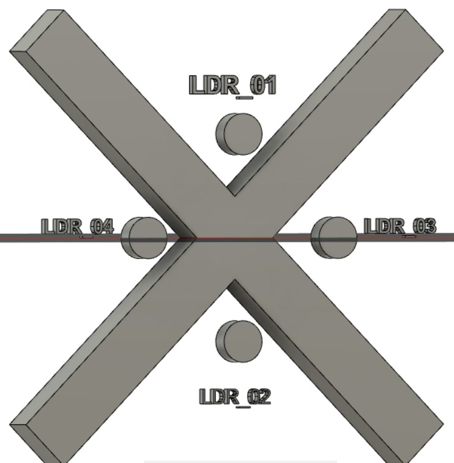

# Solar-Tracker

Solar trackers are devices used to orient photovoltaic panels, reflectors, lenses or other optical devices toward the sun. Since the sun's position in the sky changes with the seasons and the time of day, trackers are used to align the collection system to maximize energy production.
This project uses an Arduino as a controller, 4 LDR sensors (Light Dependent resistors) or photo-resistors for sensing direction of incidendent light, 2 Servo-Motors for changing direction of the solar plane.
The 4 sensors are placed in such orientation

This object having the sensors can be attached on top of a Solar Panel or a Solar Reflector. The servo motor 01 will give motion in Y axis while servo motor 02 will give motion in X axis depending on the relative value input by the LDRs.
Connect LDRs to analog pins and servo motors to digital pins of arduino nano/uno as specified in the program.
